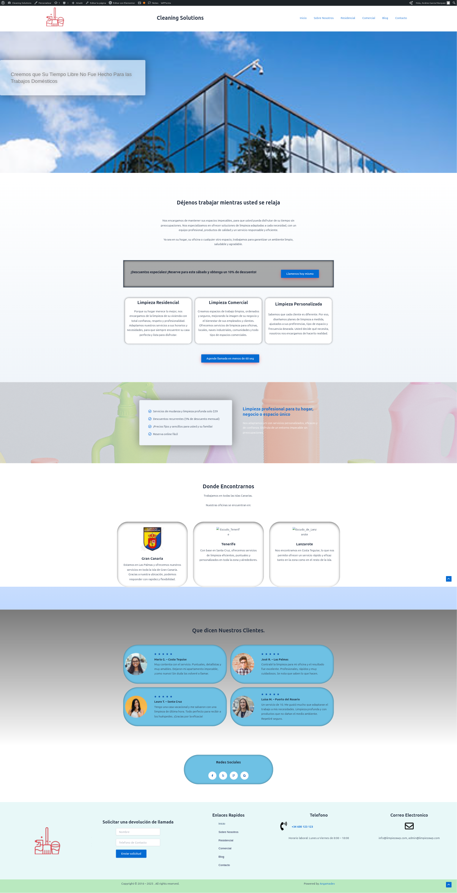
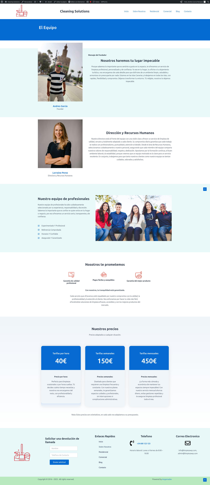
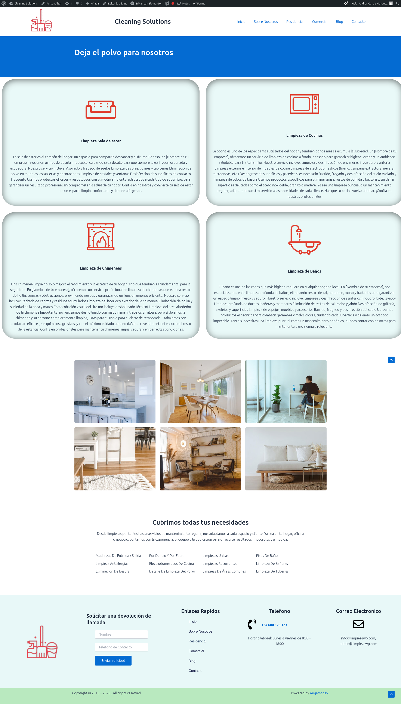
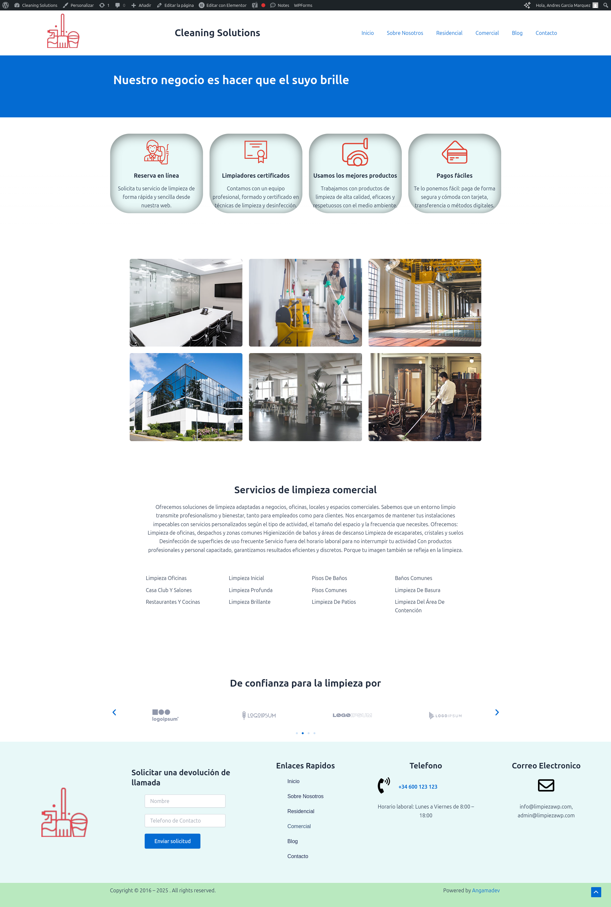
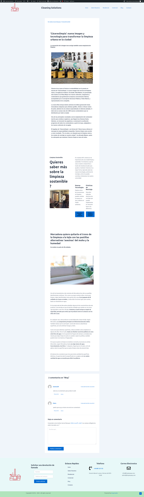
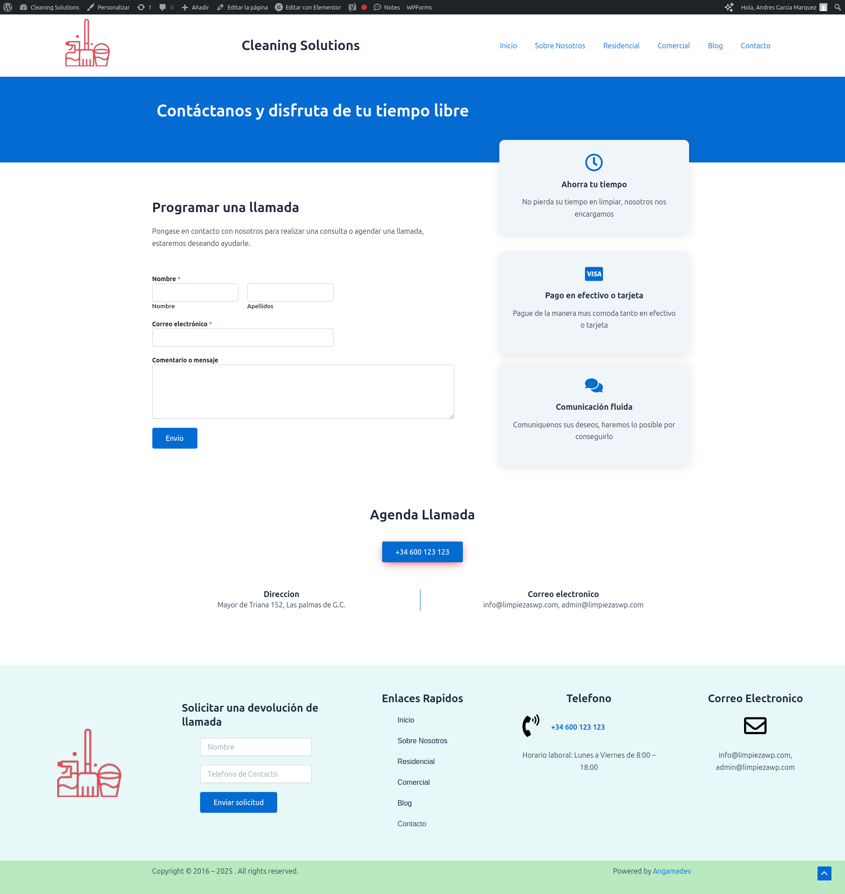

# 🌐 Proyecto Web con WordPress – Limpiezas WP

Este repositorio documenta un proyecto personal de creación de una página web con **WordPress**, como parte de mi portfolio.

🔗 **Sitio web online:** [limpiezaswp.infinityfreeapp.com](https://limpiezaswp.infinityfreeapp.com)

---

## 🧰 Herramientas utilizadas

- WordPress como CMS
- Hosting gratuito con InfinityFree
- Tema responsive adaptado al sector de limpieza
- Plugins básicos para formularios, SEO y personalización visual

---

## 🖼️ Capturas

Vista previa del sitio web:

### Página de inicio

### Sobre Nosotros

### Servicios

### Blog

### Contacto

---

## 🎯 Objetivo

El objetivo de este proyecto es demostrar conocimientos en:

- Instalación y configuración de WordPress
- Estructuración de contenido y diseño orientado a servicios
- Optimización para navegabilidad y experiencia de usuario

---

## 📌 Nota

Este sitio es un ejemplo funcional dentro de un entorno de hosting gratuito. No representa a una empresa real.

# Descripción del proyecto – Limpiezas WP

Este proyecto consiste en una página web desarrollada con WordPress, simulando una empresa de servicios de limpieza. El propósito es demostrar mis habilidades en la creación de sitios web usando herramientas actuales.

## Estructura de la web

- **Inicio**: Presentación del negocio y llamada a la acción
- **Servicios**: Detalle de los servicios ofrecidos
- **Contacto**: Formulario y datos de contacto
- **Pie de página**: Datos legales, redes y accesos rápidos

## Tema y plugins

- **Tema**: Tema ligero, responsive (por ejemplo, Astra o Hello)
- **Constructor**: Elementor (si se utilizó)
- **Plugins**:
  - Contact Form 7
  - Yoast SEO
  - WP Super Cache (para rendimiento)

## Hosting

El sitio se aloja de forma gratuita en InfinityFree, lo cual permite hacer pruebas y mostrar el proyecto sin coste.

## Próximos pasos (opcional)

- Migración a un hosting propio
- Implementar blog
- Mejorar SEO con contenido dinámico
